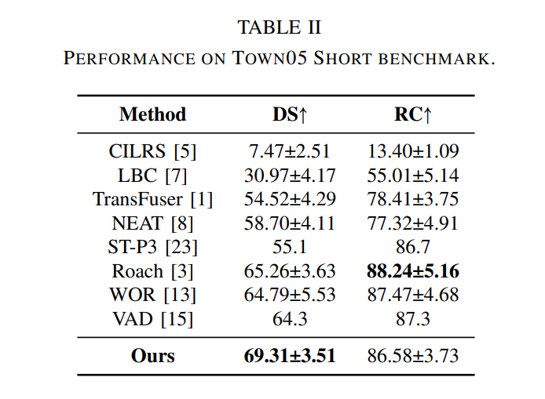
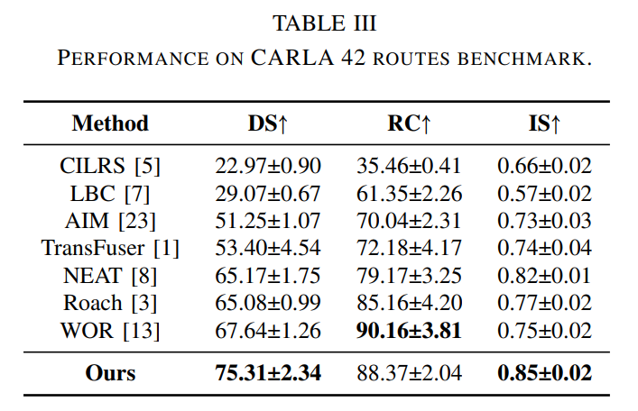

# STIO

here's the framework of paper named "STIO: Enhancing Autonomous Driving with Forward-Looking Perception and Trajectory Re-Optimization"

Spatio-Temporal Inference Module

Interaction Optimization Module

# Abstract
Heavy traffic and complex urban dynamics hinder the deployment of autonomous driving. In such environments, relying solely on real-time perception can result in locally optimal decisions, which may not always align with the best long-term decisions. Additionally, the actions of other participants influence subsequent decisions, and neglecting these interactions increases collision risks. In this work, we propose STIO, an end-to-end driving framework with two key advantages: forward-looking perception, which predicts future environment for better long-term decision-making; incorporating trajectory re-optimization, which considers future interactions of the coarse trajectory to refine decisions. The proposed STIO utilizes critical but often overlooked historical information to predict future driving environment features. It learns the temporal changes in bird's-eye view (BEV) spatial features between consecutive frames, enabling forward-looking perception for decision-making. Furthermore, to mitigate collision risks in dense urban driving settings, the method optimizes the trajectory of the ego vehicle based on predicted future interactions with other traffic participants. Experiments on three CARLA benchmarks show STIO achieve state-of-the-art driving score compared to methods with similar training data.

### Codes
Code will be updated soon!
### Experiment Results
This is experimental results:

Ablation study:

